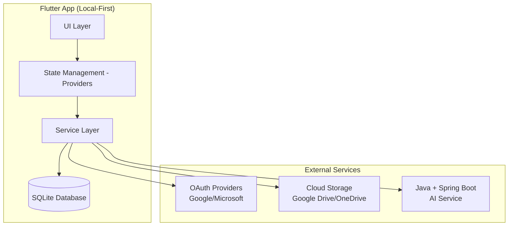

# Design Document

## Overview

This design document outlines the re-architecture of Hi-Doc from a Flutter + Node.js backend system to a fully standalone/offline Flutter application. The new architecture will eliminate dependencies on the custom backend for CRUD operations, implement local-first data storage with SQLite, and provide cloud backup/restore capabilities through OAuth-based cloud storage integration.

## Architecture

### High-Level Architecture



### Core Architectural Principles

1. **Offline-First**: All core functionality works without internet connectivity
2. **Local Data Sovereignty**: User data is stored locally and encrypted
3. **Minimal External Dependencies**: Only authentication and AI services require external connectivity
4. **Cloud Backup Optional**: Users can optionally backup to cloud storage based on their OAuth provider
5. **Rate-Limited AI**: AI usage is tracked locally and limited to 100 calls per user per month

## Components and Interfaces

### 1. Data Layer Refactoring

#### Current State
- Mixed local SQLite and HTTP API calls to Node.js backend
- Web platform uses backend APIs, native platforms use local SQLite
- Inconsistent data access patterns

#### New Design
- **Pure Local SQLite**: All CRUD operations use local SQLite database
- **Unified Data Access**: Same data access patterns across all platforms
- **Repository Pattern**: Clean abstraction layer for data operations

```dart
// New Repository Interface
abstract class Repository<T> {
  Future<String> create(T entity);
  Future<T?> findById(String id);
  Future<List<T>> findAll({Map<String, dynamic>? filters});
  Future<void> update(String id, T entity);
  Future<void> delete(String id);
}

// Example Implementation
class MedicationRepository implements Repository<Medication> {
  final DatabaseService _db;
  
  MedicationRepository(this._db);
  
  @override
  Future<String> create(Medication medication) async {
    // Pure SQLite implementation
    return await _db.insertMedication(medication.toMap());
  }
  
  // ... other methods
}
```

### 2. Authentication Service Redesign

#### Current State
- Firebase Auth for Google sign-in
- Microsoft OAuth through AppAuth with backend token exchange
- Mixed authentication patterns

#### New Design
- **Streamlined OAuth**: Direct OAuth integration without backend dependency
- **Local Token Storage**: Secure local storage of authentication tokens
- **Provider-Based Backup**: Authentication provider determines backup service

```dart
class AuthService {
  // Simplified authentication without backend dependency
  Future<AuthResult> signInWithGoogle();
  Future<AuthResult> signInWithMicrosoft();
  
  // Local token management
  Future<String?> getAccessToken();
  Future<String?> getRefreshToken();
  
  // Determine backup provider
  BackupProvider getBackupProvider();
}
```

### 3. Cloud Backup/Restore Service

#### New Component Design
- **Provider-Agnostic Interface**: Common interface for different cloud providers
- **Encrypted Backup**: Database files are encrypted before upload
- **Conflict Resolution**: Handle conflicts when restoring on multiple devices

```dart
abstract class CloudBackupService {
  Future<void> backup(File databaseFile);
  Future<File?> restore();
  Future<List<BackupMetadata>> listBackups();
  Future<void> deleteBackup(String backupId);
}

class GoogleDriveBackupService implements CloudBackupService {
  // Google Drive specific implementation
}

class OneDriveBackupService implements CloudBackupService {
  // OneDrive specific implementation
}
```

### 4. AI Service Integration

#### Current State
- Mixed local and backend AI processing
- No rate limiting
- Inconsistent AI response handling

#### New Design
- **External AI Backend**: All AI requests go to Java + Spring Boot backend
- **Local Rate Limiting**: Track usage locally with monthly limits
- **Offline Response Caching**: Store AI responses locally for offline access

```dart
class AIService {
  final AIRateLimiter _rateLimiter;
  final HttpClient _httpClient;
  
  Future<AIResponse?> processHealthQuery(String query) async {
    // Check rate limit locally
    if (!await _rateLimiter.canMakeRequest()) {
      throw RateLimitExceededException();
    }
    
    // Make request to external AI backend
    final response = await _httpClient.post('/ai/health-query', {
      'query': query,
      'userId': getCurrentUserId(),
    });
    
    // Store response locally and update rate limit
    await _storeResponseLocally(response);
    await _rateLimiter.recordRequest();
    
    return response;
  }
}
```

### 5. Offline-First State Management

#### Provider Refactoring
- **Local-Only Providers**: Remove all HTTP dependencies from providers
- **Optimistic Updates**: Update UI immediately, handle errors gracefully
- **Connectivity Awareness**: Provide clear feedback about online/offline features

```dart
class ChatProvider extends ChangeNotifier {
  final DatabaseService _db;
  final AIService _aiService;
  final ConnectivityService _connectivity;
  
  Future<void> sendMessage(String text) async {
    // Always store locally first
    final message = await _db.insertMessage(text);
    notifyListeners();
    
    // Try AI processing if online
    if (_connectivity.isOnline) {
      try {
        final aiResponse = await _aiService.processHealthQuery(text);
        await _db.insertMessage(aiResponse.text);
        notifyListeners();
      } catch (e) {
        // Handle AI errors gracefully
        _handleAIError(e);
      }
    }
  }
}
```

## Data Models

### Enhanced Local Database Schema

```sql
-- Core health data (unchanged)
CREATE TABLE health_entries (
  id TEXT PRIMARY KEY,
  person_id TEXT,
  timestamp INTEGER NOT NULL,
  type TEXT NOT NULL,
  data TEXT NOT NULL
);

-- Enhanced user management
CREATE TABLE users (
  id TEXT PRIMARY KEY,
  email TEXT UNIQUE,
  name TEXT,
  provider TEXT, -- 'google' or 'microsoft'
  created_at INTEGER,
  last_backup_at INTEGER
);

-- AI usage tracking
CREATE TABLE ai_usage (
  id TEXT PRIMARY KEY,
  user_id TEXT,
  month_year TEXT, -- 'YYYY-MM' format
  request_count INTEGER DEFAULT 0,
  last_request_at INTEGER,
  FOREIGN KEY(user_id) REFERENCES users(id)
);

-- Backup metadata
CREATE TABLE backup_metadata (
  id TEXT PRIMARY KEY,
  user_id TEXT,
  backup_date INTEGER,
  file_size INTEGER,
  cloud_provider TEXT,
  cloud_file_id TEXT,
  FOREIGN KEY(user_id) REFERENCES users(id)
);

-- Cached AI responses
CREATE TABLE ai_responses (
  id TEXT PRIMARY KEY,
  query_hash TEXT, -- Hash of the original query
  response_text TEXT,
  created_at INTEGER,
  user_id TEXT,
  FOREIGN KEY(user_id) REFERENCES users(id)
);
```

## Error Handling

### Comprehensive Error Strategy

1. **Network Errors**: Graceful degradation when offline
2. **Authentication Errors**: Clear user guidance for re-authentication
3. **Storage Errors**: Backup and recovery mechanisms
4. **AI Service Errors**: Fallback to cached responses or manual entry

```dart
class ErrorHandler {
  static void handleError(Exception error, BuildContext context) {
    switch (error.runtimeType) {
      case NetworkException:
        _showOfflineMessage(context);
        break;
      case AuthenticationException:
        _promptReAuthentication(context);
        break;
      case RateLimitExceededException:
        _showRateLimitMessage(context);
        break;
      case StorageException:
        _handleStorageError(error, context);
        break;
      default:
        _showGenericError(context);
    }
  }
}
```

## Testing Strategy

### Multi-Layer Testing Approach

1. **Unit Tests**: Repository layer, service layer, and business logic
2. **Integration Tests**: Database operations and cloud service integration
3. **Widget Tests**: UI components and user interactions
4. **End-to-End Tests**: Complete user workflows in offline and online modes

```dart
// Example repository test
class MedicationRepositoryTest {
  late DatabaseService mockDb;
  late MedicationRepository repository;
  
  setUp() {
    mockDb = MockDatabaseService();
    repository = MedicationRepository(mockDb);
  }
  
  testCreateMedication() async {
    final medication = Medication(name: 'Test Med');
    final id = await repository.create(medication);
    
    verify(mockDb.insertMedication(any)).called(1);
    expect(id, isNotEmpty);
  }
}
```

### Testing Offline Scenarios

```dart
class OfflineTestSuite {
  testOfflineDataAccess() {
    // Verify all core features work without network
  }
  
  testOnlineToOfflineTransition() {
    // Test graceful handling of connectivity loss
  }
  
  testOfflineToOnlineSync() {
    // Test data synchronization when connectivity returns
  }
}
```

## Migration Strategy

### Phase 1: Service Layer Refactoring
1. Create new repository interfaces
2. Implement pure SQLite repositories
3. Update service classes to use repositories
4. Remove HTTP client dependencies from core services

### Phase 2: Authentication Simplification
1. Implement direct OAuth flows
2. Remove backend token exchange
3. Add cloud storage service selection
4. Update authentication UI flows

### Phase 3: AI Service Integration
1. Implement AI rate limiting
2. Create external AI service client
3. Add local AI response caching
4. Update chat provider to use new AI service

### Phase 4: Cloud Backup Implementation
1. Implement Google Drive backup service
2. Implement OneDrive backup service
3. Add backup/restore UI
4. Implement conflict resolution

### Phase 5: Testing and Optimization
1. Comprehensive testing of offline scenarios
2. Performance optimization
3. Security audit of local data storage
4. User experience refinement

## Security Considerations

### Data Protection
- **Local Encryption**: All local data encrypted at rest
- **Secure Token Storage**: OAuth tokens stored securely
- **Cloud Backup Encryption**: Database files encrypted before cloud upload
- **Access Control**: Proper authentication checks for all operations

### Privacy Measures
- **Minimal Data Collection**: Only collect necessary user information
- **Local Processing**: Health data processed locally when possible
- **Transparent Backup**: Clear user consent for cloud backup
- **Data Portability**: Easy export of user data

## Performance Optimizations

### Database Performance
- **Proper Indexing**: Optimize queries with appropriate indexes
- **Connection Pooling**: Efficient database connection management
- **Batch Operations**: Group related operations for better performance
- **Query Optimization**: Use efficient SQL queries and prepared statements

### UI Performance
- **Lazy Loading**: Load data on demand
- **Efficient State Management**: Minimize unnecessary rebuilds
- **Image Optimization**: Optimize images and assets
- **Memory Management**: Proper disposal of resources